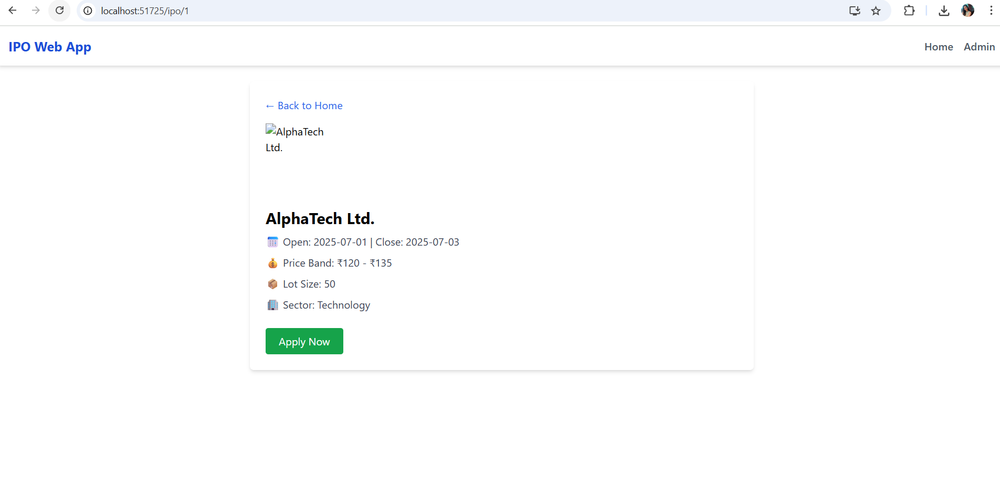
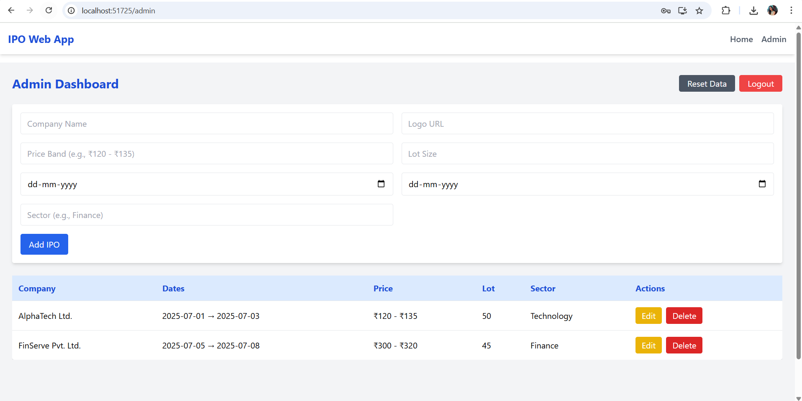

# 📊 IPO Web Application – Bluestock Fintech Internship Project

A fully responsive and interactive IPO platform built using **ReactJS** + **TailwindCSS**, featuring:

- 📋 Upcoming IPO Listings  
- 🔍 Search and Filter by sector or company  
- 👩‍💼 Admin Dashboard for Add/Edit/Delete IPOs  
- 🛡️ LocalStorage as data source (No backend)  
- 💡 Based on real Figma UI from Bluestock  

---

## 🚀 Live Demo

🔗 [https://wanshita-singh.github.io/ipo-web-app](https://wanshita-singh.github.io/ipo-web-app)

---

## 🖼️ Screenshots

### 📌 Homepage


### 📌 IPO Detail Page



### 📌 Admin Dashboard



---

## 🛠️ Technology Stack

- **Frontend**: ReactJS  
- **Styling**: TailwindCSS  
- **Routing**: React Router DOM  
- **State Mgmt**: useState + useEffect  
- **Storage**: LocalStorage (temporary storage for IPO data)  
- **No backend used** – Dummy JSON data for testing  

---

## 📁 Folder Structure

```txt
ipo-web-app/
├── public/
├── src/
│   ├── components/       # Reusable UI components
│   ├── pages/            # Home, Admin, Login pages
│   ├── assets/           # Logos and fallback images
│   └── App.js, index.js
├── screenshots/          # PNG screenshots for README
└── README.md
```
---
## 🧪 Setup & Run

### 1. Clone the repo

```bash
git clone https://github.com/wanshita-singh/ipo-web-app.git
cd ipo-web-app
```

### 2. Install dependencies

```bash
npm install
```

### 3. Start the development server

```bash
npm start
```

---

## ⚙️ Build & Deploy

### To create a production-ready build:

```bash
npm run build
```
### To deploy to GitHub Pages:

```bash
npm run deploy
```


---

## 🙋‍♀️ Author

**Wanshita Singh**  
Frontend Intern at Bluestock Fintech  
📧 wanshu2204@gmail.com  
🔗 [GitHub Profile](https://github.com/wanshita-singh)

---

## 🔒 License

This project is the intellectual property of **Bluestock Fintech**.  
Do not share, distribute, or reuse without written authorization.
